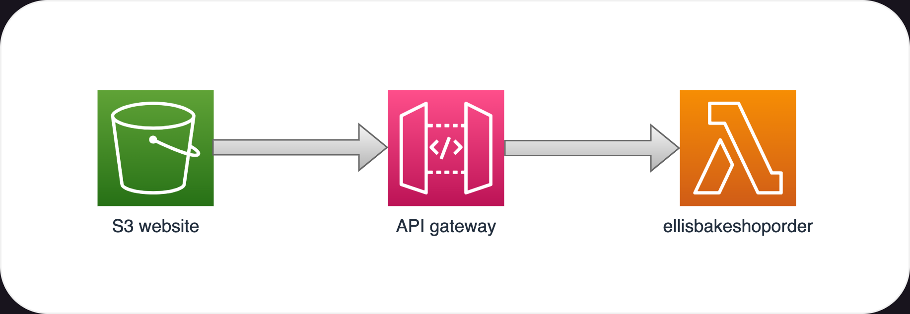

# setup

1. upload all content in s3 folder to a s3 website
1. create a lambda and upload the python files in the lambda folder
1. set up an API gateway with an ANY method with proxy integration and set your lambda as the target of the lambda integration

